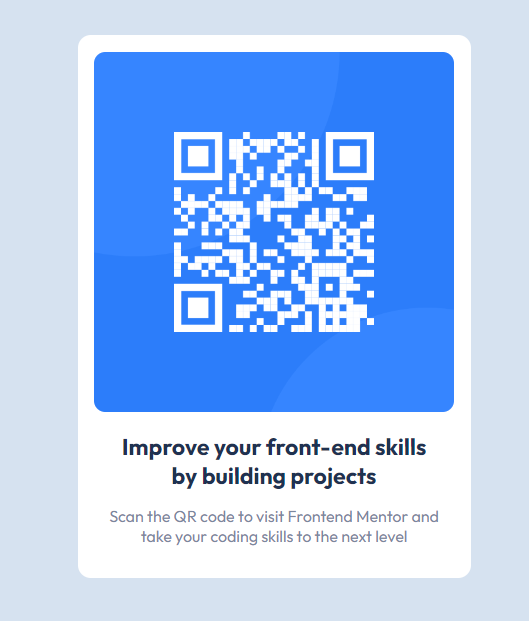

# Frontend Mentor - QR code component solution

This is a solution to the [QR code component challenge on Frontend Mentor](https://www.frontendmentor.io/challenges/qr-code-component-iux_sIO_H). 
## Table of contents

- [Overview](#overview)
  - [Screenshot](#screenshot)
  - [Links](#links)
- [My process](#my-process)
  - [Built with](#built-with)
  - [What I learned](#what-i-learned)
  - [Continued development](#continued-development)
- [Author](#author)
## Overview

### Screenshot

### Links

- Solution URL:(https://www.frontendmentor.io/solutions/qr-code-solution-mbgk6PaIIu)
- Live Site URL:(https://qr-code-component-seven-wine.vercel.app/)

## My process

### Built with

- Semantic HTML5 markup
- CSS custom properties
- Flexbox
- CSS

### What I learned

I learned css custom properties and responsive design
### Continued development
Actually i learned a bit css responsive design but i dont learn it completly and i keep contine to the learn responsive design

## Author
[hakcinar]
